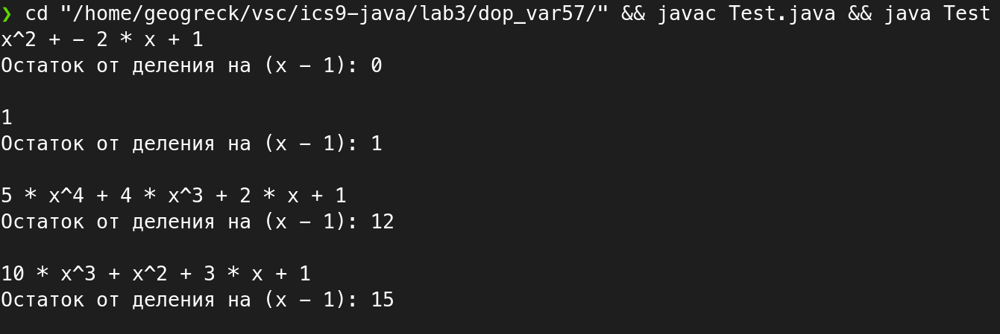

# Цели

Приобретение навыков реализации интерфейсов для обеспечения возможности
полиморфной обработки объектов класса.

# Задачи

Класс, представляющий полином, с порядком на основе
величины числа, которое надо прибавить к полиному, чтобы
он без остатка делился на (x-1).

# Решение

## Исходный код

**`Polynom.java`**

```java
public class Polynom implements Comparable<Polynom> {
    int coefficients[];
    int remainder = 0;

    public Polynom(int... inCoefs){
        int len = inCoefs.length;
        coefficients = new int[len];

        for (int i = len - 1; i >= 0; i--) {
            coefficients[len - i - 1] = inCoefs[i];
            remainder += inCoefs[i];
        }
    }

    @Override
    public int compareTo(Polynom obj) {
        return this.remainder - obj.remainder;
    }

    @Override
    public String toString() {
        String ans = "";
        String xStrTemp = " * x^";
        String xStr;
        for (int i = coefficients.length - 1; i > 0; i--) {
            int k = coefficients[i];
            if (i == 1) {
                if (coefficients[0] != 0){
                    xStr = " * x + ";
                } else {
                    xStr = " * x";
                }
            } else {
                xStr = xStrTemp + i + " + ";
            }
            ans += (k < 0 ? "- " + -1 * k + xStr : (k == 0 ? "" : 
                (k == 1 ? "x^" + i + " + " : k + xStr))) ;
        }
        ans += (coefficients[0] != 0 ? coefficients[0] : "") + "\nОстаток от деления на (x - 1): " + remainder + "\n";
        return ans;
    }

}
```

**`Test.java`**

```java
import java.util.Arrays;

public class Test {
    public static void main(String[] args) {
        Polynom[] polynoms = new Polynom[]{
            new Polynom(1, -2, 1),
            new Polynom(5, 4, 0, 2, 1),
            new Polynom(10, 1, 3, 1),
            new Polynom(1)
        };
        Arrays.sort(polynoms);
        for (Polynom polynom : polynoms) {
            System.out.println(polynom);
        }
    }
}
```

## Пример вывода


