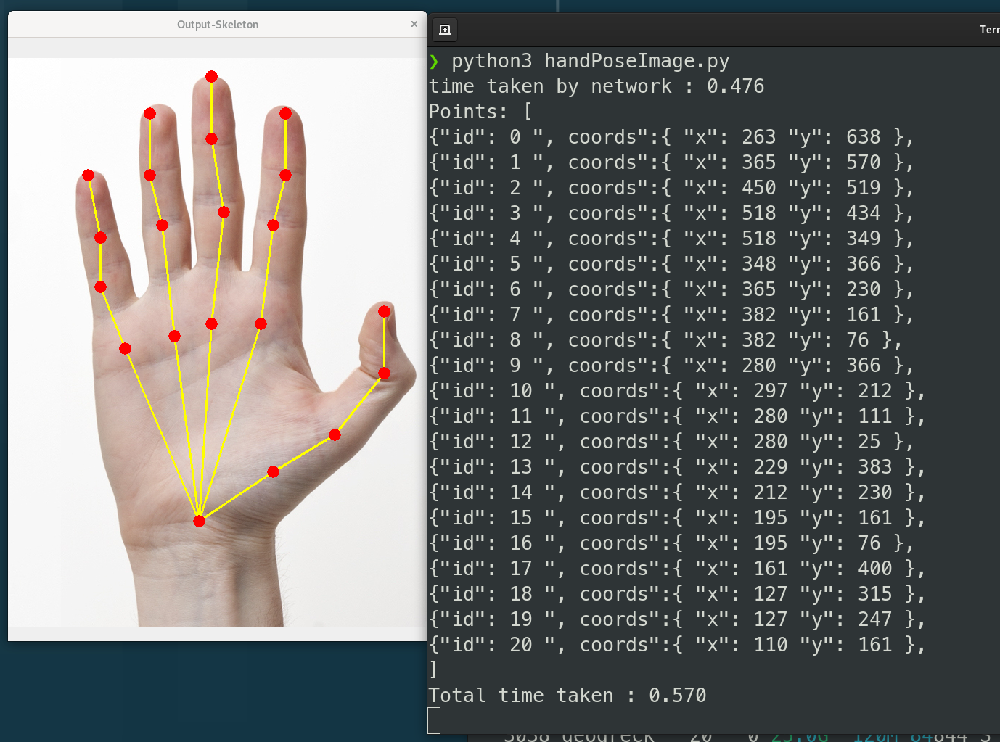
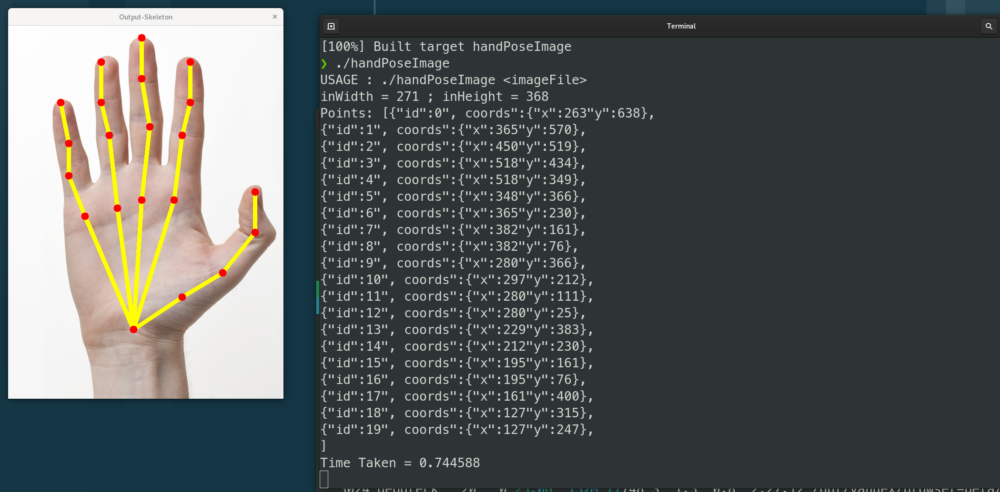
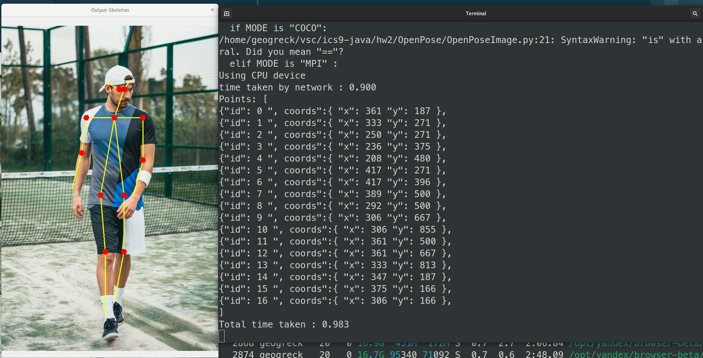
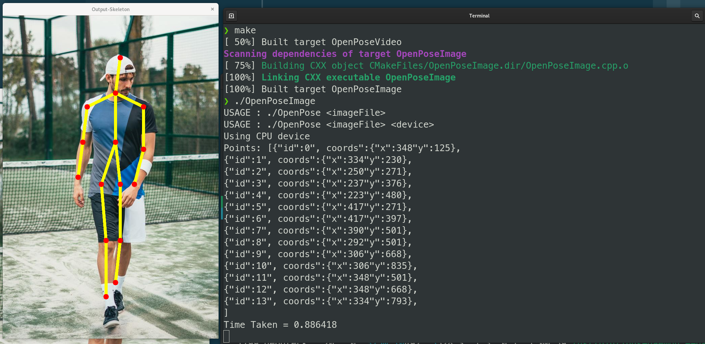
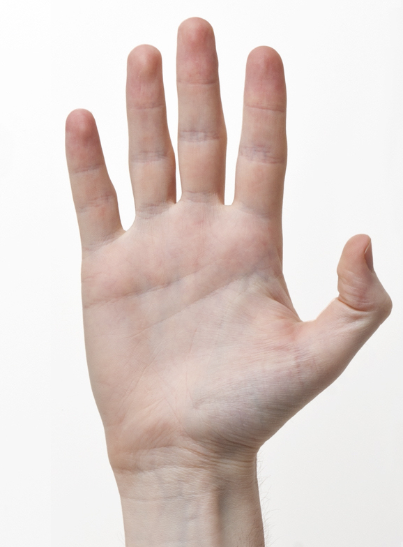
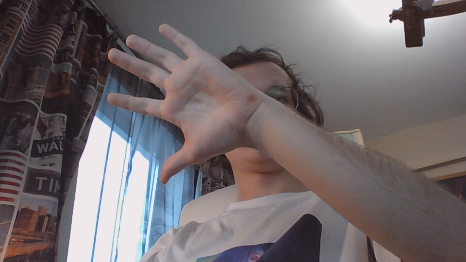

# Содержание
- [Содержание](#содержание)
- [Цели](#цели)
- [Задачи](#задачи)
- [Решение](#решение)
  - [Распознавание точек кисти](#распознавание-точек-кисти)
  - [Распознование точек тела](#распознование-точек-тела)
  - [Сравнение скорости работы алгоритма распознования кисти руки на **`C++`** и **`python`**](#сравнение-скорости-работы-алгоритма-распознования-кисти-руки-на-c-и-python)
  - [Сравнение скорости работы разных алгоритмов распознавания кисти руки на **`python`**](#сравнение-скорости-работы-разных-алгоритмов-распознавания-кисти-руки-на-python)
  - [Изображения, которые использовались в ходе работы:](#изображения-которые-использовались-в-ходе-работы)
- [Выводы](#выводы)

# Цели

Знакомство с возможностями языка С++ и Python для реализации задач машинного зрения.

# Задачи

Реализовать на `C++` и `Python` под любую ОС по желанию студента следующие задачи:

1. Распознавание координат точек кисти со снимков получаемых с камеры, координаты точек выводятся списком в консоль в формате `JSON`.
   
2. Распознавание координат точек тела со снимков получаемых с камеры, координаты точек выводятся списком в консоль в формате `JSON`.
   
3. Сравнить скорость работы алгоритма распознавания кисти руки выполненного на C++ со скоростью распознавания выполненного на `Python`. В отчете привести сравнение скоростей.
   
4. Сравнить скорость распознавания кисти руки алгоритмом выполненным на языке `Python` в этом Модуле со скоростью алгоритма распознавания кисти руки на базе **`Mediapipe`** выполненным на языке `Python` в предыдущем **`Модуле №1`**. В отчете привести сравнение скоростей.
   
5. Сделать выводы.

# Решение

Мною был реализован вывод координат точек в JSON как для анализа снимков, так и для видео. Однако в отчете будет показан лишь результат вывода для анализа снимков, в том числе и с камеры.

## Распознавание точек кисти

Исходный код на **`Python`**:

**`handPoseImage.py`**

```{.python .number-lines}
from __future__ import division
import cv2
import time
import numpy as np

protoFile = "hand/pose_deploy.prototxt"
weightsFile = "hand/pose_iter_102000.caffemodel"
nPoints = 22
POSE_PAIRS = [ [0,1],[1,2],[2,3],[3,4],[0,5],[5,6],[6,7],[7,8],[0,9],[9,10],[10,11],[11,12],[0,13],[13,14],[14,15],[15,16],[0,17],[17,18],[18,19],[19,20] ]
net = cv2.dnn.readNetFromCaffe(protoFile, weightsFile)

frame = cv2.imread("right-frontal.jpg")
frameCopy = np.copy(frame)
frameWidth = frame.shape[1]
frameHeight = frame.shape[0]
aspect_ratio = frameWidth/frameHeight

threshold = 0.1

t = time.time()
# input image dimensions for the network
inHeight = 368
inWidth = int(((aspect_ratio*inHeight)*8)//8)
inpBlob = cv2.dnn.blobFromImage(frame, 1.0 / 255, (inWidth, inHeight), (0, 0, 0), swapRB=False, crop=False)

net.setInput(inpBlob)

output = net.forward()
print("time taken by network : {:.3f}".format(time.time() - t))

# Empty list to store the detected keypoints
points = []
count = 0
for i in range(nPoints):
    # confidence map of corresponding body's part.
    probMap = output[0, i, :, :]
    probMap = cv2.resize(probMap, (frameWidth, frameHeight))

    # Find global maxima of the probMap.
    minVal, prob, minLoc, point = cv2.minMaxLoc(probMap)

    if prob > threshold :
        cv2.circle(frameCopy, (int(point[0]), int(point[1])), 8, (0, 255, 255), thickness=-1, lineType=cv2.FILLED)
        cv2.putText(frameCopy, "{}".format(i), (int(point[0]), int(point[1])), cv2.FONT_HERSHEY_SIMPLEX, 1, (0, 0, 255), 2, lineType=cv2.LINE_AA)

        # Add the point to the list if the probability is greater than the threshold
        points.append((int(point[0]), int(point[1])))
        count+=1
    else :
        points.append(None)

if count > 1:
    print ("Points: [")
    i = 0
    k = 0
    while k < count:
        if points[i] != None:
            print ("{\"id\":", k, "\", coords\":{", "\"x\":", points[i][0], "\"y\":", points[i][1], "}, ")
            k+=1
        i+=1    
    #print ("{\"id\":", count - 1, "\", coords\":{", "\"x\":", points[count - 1][0], "\"y\":", points[count - 1][1], "} ")
    print ("]")
# Draw Skeleton
for pair in POSE_PAIRS:
    partA = pair[0]
    partB = pair[1]
    if points[partA] and points[partB]:
        cv2.line(frame, points[partA], points[partB], (0, 255, 255), 2)
        cv2.circle(frame, points[partA], 8, (0, 0, 255), thickness=-1, lineType=cv2.FILLED)
        cv2.circle(frame, points[partB], 8, (0, 0, 255), thickness=-1, lineType=cv2.FILLED)


cv2.imshow('Output-Keypoints', frameCopy)
cv2.imshow('Output-Skeleton', frame)


cv2.imwrite('Output-Keypoints.jpg', frameCopy)
cv2.imwrite('Output-Skeleton.jpg', frame)

print("Total time taken : {:.3f}".format(time.time() - t))

cv2.waitKey(0)

```



Исходный код на языке **`C++`**:

```{.cpp .number-lines}
#include <opencv2/dnn.hpp>
#include <opencv2/imgproc.hpp>
#include <opencv2/highgui.hpp>
#include <iostream>

using namespace std;
using namespace cv;
using namespace cv::dnn;


const int POSE_PAIRS[20][2] =
{
    {0,1}, {1,2}, {2,3}, {3,4},         // thumb
    {0,5}, {5,6}, {6,7}, {7,8},         // index
    {0,9}, {9,10}, {10,11}, {11,12},    // middle
    {0,13}, {13,14}, {14,15}, {15,16},  // ring
    {0,17}, {17,18}, {18,19}, {19,20}   // small
};

string protoFile = "hand/pose_deploy.prototxt";
string weightsFile = "hand/pose_iter_102000.caffemodel";

int nPoints = 22;

int main(int argc, char **argv)
{

    cout << "USAGE : ./handPoseImage <imageFile> " << endl;

    string imageFile = "right-frontal.jpg";
    // Take arguments from commmand line
    if (argc == 2)
    {
      imageFile = argv[1];
    }

    float thresh = 0.01;

    Mat frame = imread(imageFile);
    Mat frameCopy = frame.clone();
    int frameWidth = frame.cols;
    int frameHeight = frame.rows;

    float aspect_ratio = frameWidth/(float)frameHeight;
    int inHeight = 368;
    int inWidth = (int(aspect_ratio*inHeight) * 8) / 8;

    cout << "inWidth = " << inWidth << " ; inHeight = " << inHeight << endl;

    double t = (double) cv::getTickCount();
    Net net = readNetFromCaffe(protoFile, weightsFile);

    Mat inpBlob = blobFromImage(frame, 1.0 / 255, Size(inWidth, inHeight), Scalar(0, 0, 0), false, false);

    net.setInput(inpBlob);

    Mat output = net.forward();

    int H = output.size[2];
    int W = output.size[3];

    // find the position of the body parts
    vector<Point> points(nPoints);
    for (int n=0; n < nPoints; n++)
    {
        // Probability map of corresponding body's part.
        Mat probMap(H, W, CV_32F, output.ptr(0,n));
        resize(probMap, probMap, Size(frameWidth, frameHeight));

        Point maxLoc;
        double prob;
        minMaxLoc(probMap, 0, &prob, 0, &maxLoc);
        if (prob > thresh)
        {
            circle(frameCopy, cv::Point((int)maxLoc.x, (int)maxLoc.y), 8, Scalar(0,255,255), -1);
            cv::putText(frameCopy, cv::format("%d", n), cv::Point((int)maxLoc.x, (int)maxLoc.y), cv::FONT_HERSHEY_COMPLEX, 1, cv::Scalar(0, 0, 255), 2);

        }
        points[n] = maxLoc;
    }

    int nPairs = sizeof(POSE_PAIRS)/sizeof(POSE_PAIRS[0]);

    if (nPairs > 0){
        cout<<"Points: [";
    }
    for (int n = 0; n < nPairs; n++)
    {
        // lookup 2 connected body/hand parts
        Point2f partA = points[POSE_PAIRS[n][0]];
        Point2f partB = points[POSE_PAIRS[n][1]];

        if (partA.x<=0 || partA.y<=0 || partB.x<=0 || partB.y<=0)
            continue;

        cout<<"{\"id\":"<< n << "\", coords\":{"<< "\"x\":"<< points[n].x<< "\"y\":"<< points[n].y<< "}, ";

        line(frame, partA, partB, Scalar(0,255,255), 8);
        circle(frame, partA, 8, Scalar(0,0,255), -1);
        circle(frame, partB, 8, Scalar(0,0,255), -1);
    }
    if (nPairs > 0){
        cout<<"]\n";
    }

    t = ((double)cv::getTickCount() - t)/cv::getTickFrequency();
    cout << "Time Taken = " << t << endl;
    imshow("Output-Keypoints", frameCopy);
    imshow("Output-Skeleton", frame);
    imwrite("Output-Skeleton.jpg", frame);

    waitKey();

    return 0;
}

```



## Распознование точек тела

Исходный код на **`Python`**:

```{.python .number-lines}
import cv2
import time
import numpy as np
import argparse

parser = argparse.ArgumentParser(description='Run keypoint detection')
parser.add_argument("--device", default="cpu", help="Device to inference on")
parser.add_argument("--image_file", default="single.jpeg", help="Input image")

args = parser.parse_args()


MODE = "COCO"

if MODE is "COCO":
    protoFile = "pose/coco/pose_deploy_linevec.prototxt"
    weightsFile = "pose/coco/pose_iter_440000.caffemodel"
    nPoints = 18
    POSE_PAIRS = [ [1,0],[1,2],[1,5],[2,3],[3,4],[5,6],[6,7],[1,8],[8,9],[9,10],[1,11],[11,12],[12,13],[0,14],[0,15],[14,16],[15,17]]

elif MODE is "MPI" :
    protoFile = "pose/mpi/pose_deploy_linevec_faster_4_stages.prototxt"
    weightsFile = "pose/mpi/pose_iter_160000.caffemodel"
    nPoints = 15
    POSE_PAIRS = [[0,1], [1,2], [2,3], [3,4], [1,5], [5,6], [6,7], [1,14], [14,8], [8,9], [9,10], [14,11], [11,12], [12,13] ]


frame = cv2.imread(args.image_file)
frameCopy = np.copy(frame)
frameWidth = frame.shape[1]
frameHeight = frame.shape[0]
threshold = 0.1

net = cv2.dnn.readNetFromCaffe(protoFile, weightsFile)

if args.device == "cpu":
    net.setPreferableBackend(cv2.dnn.DNN_TARGET_CPU)
    print("Using CPU device")
elif args.device == "gpu":
    net.setPreferableBackend(cv2.dnn.DNN_BACKEND_CUDA)
    net.setPreferableTarget(cv2.dnn.DNN_TARGET_CUDA)
    print("Using GPU device")

t = time.time()
# input image dimensions for the network
inWidth = 368
inHeight = 368
inpBlob = cv2.dnn.blobFromImage(frame, 1.0 / 255, (inWidth, inHeight),
                          (0, 0, 0), swapRB=False, crop=False)

net.setInput(inpBlob)

output = net.forward()
print("time taken by network : {:.3f}".format(time.time() - t))

H = output.shape[2]
W = output.shape[3]

# Empty list to store the detected keypoints
points = []
count = 0

for i in range(nPoints):
    # confidence map of corresponding body's part.
    probMap = output[0, i, :, :]

    # Find global maxima of the probMap.
    minVal, prob, minLoc, point = cv2.minMaxLoc(probMap)
    
    # Scale the point to fit on the original image
    x = (frameWidth * point[0]) / W
    y = (frameHeight * point[1]) / H

    if prob > threshold : 
        cv2.circle(frameCopy, (int(x), int(y)), 8, (0, 255, 255), thickness=-1, lineType=cv2.FILLED)
        cv2.putText(frameCopy, "{}".format(i), (int(x), int(y)), cv2.FONT_HERSHEY_SIMPLEX, 1, (0, 0, 255), 2, lineType=cv2.LINE_AA)

        # Add the point to the list if the probability is greater than the threshold
        points.append((int(x), int(y)))
        count+=1
    else :
        points.append(None)

# JSON output
if count > 1:
    print ("Points: [")
    i = 0
    k = 0
    while k < count:
        if points[i] != None:
            print ("{\"id\":", k, "\", coords\":{", "\"x\":", points[i][0], "\"y\":", points[i][1], "}, ")
            k+=1
        i+=1    
    #print ("{\"id\":", count - 1, "\", coords\":{", "\"x\":", points[count - 1][0], "\"y\":", points[count - 1][1], "} ")
    print ("]")

# Draw Skeleton
for pair in POSE_PAIRS:
    partA = pair[0]
    partB = pair[1]

    if points[partA] and points[partB]:
        cv2.line(frame, points[partA], points[partB], (0, 255, 255), 2)
        cv2.circle(frame, points[partA], 8, (0, 0, 255), thickness=-1, lineType=cv2.FILLED)


cv2.imshow('Output-Keypoints', frameCopy)
cv2.imshow('Output-Skeleton', frame)


cv2.imwrite('Output-Keypoints.jpg', frameCopy)
cv2.imwrite('Output-Skeleton.jpg', frame)

print("Total time taken : {:.3f}".format(time.time() - t))

cv2.waitKey(0)

```



Исходный код на **`С++`**:

```{.cpp .number-lines}
#include <opencv2/dnn.hpp>
#include <opencv2/imgproc.hpp>
#include <opencv2/highgui.hpp>
#include <iostream>

using namespace std;
using namespace cv;
using namespace cv::dnn;

#define MPI

#ifdef MPI
const int POSE_PAIRS[14][2] = 
{   
    {0,1}, {1,2}, {2,3},
    {3,4}, {1,5}, {5,6},
    {6,7}, {1,14}, {14,8}, {8,9},
    {9,10}, {14,11}, {11,12}, {12,13}
};

string protoFile = "pose/mpi/pose_deploy_linevec_faster_4_stages.prototxt";
string weightsFile = "pose/mpi/pose_iter_160000.caffemodel";

int nPoints = 15;
#endif

#ifdef COCO
const int POSE_PAIRS[17][2] = 
{   
    {1,2}, {1,5}, {2,3},
    {3,4}, {5,6}, {6,7},
    {1,8}, {8,9}, {9,10},
    {1,11}, {11,12}, {12,13},
    {1,0}, {0,14},
    {14,16}, {0,15}, {15,17}
};

string protoFile = "pose/coco/pose_deploy_linevec.prototxt";
string weightsFile = "pose/coco/pose_iter_440000.caffemodel";

int nPoints = 18;
#endif

int main(int argc, char **argv)
{

    cout << "USAGE : ./OpenPose <imageFile> " << endl;
    cout << "USAGE : ./OpenPose <imageFile> <device>" << endl;
    
    string device = "cpu";

    string imageFile = "single.jpeg";
    // Take arguments from commmand line
    if (argc == 2)
    {   
      if((string)argv[1] == "gpu")
        device = "gpu";
      else 
      imageFile = argv[1];
    }
    else if (argc == 3)
    {
        imageFile = argv[1];
        if((string)argv[2] == "gpu")
            device = "gpu";
    }


    int inWidth = 368;
    int inHeight = 368;
    float thresh = 0.1;    

    Mat frame = imread(imageFile);
    Mat frameCopy = frame.clone();
    int frameWidth = frame.cols;
    int frameHeight = frame.rows;

    double t = (double) cv::getTickCount();
    Net net = readNetFromCaffe(protoFile, weightsFile);

    if (device == "cpu")
    {
        cout << "Using CPU device" << endl;
        net.setPreferableBackend(DNN_TARGET_CPU);
    }
    else if (device == "gpu")
    {
        cout << "Using GPU device" << endl;
        net.setPreferableBackend(DNN_BACKEND_CUDA);
        net.setPreferableTarget(DNN_TARGET_CUDA);
    }

    Mat inpBlob = blobFromImage(frame, 1.0 / 255, Size(inWidth, inHeight), Scalar(0, 0, 0), false, false);

    net.setInput(inpBlob);

    Mat output = net.forward();

    int H = output.size[2];
    int W = output.size[3];

    // find the position of the body parts
    vector<Point> points(nPoints);
    for (int n=0; n < nPoints; n++)
    {
        // Probability map of corresponding body's part.
        Mat probMap(H, W, CV_32F, output.ptr(0,n));

        Point2f p(-1,-1);
        Point maxLoc;
        double prob;
        minMaxLoc(probMap, 0, &prob, 0, &maxLoc);
        if (prob > thresh)
        {
            p = maxLoc;
            p.x *= (float)frameWidth / W ;
            p.y *= (float)frameHeight / H ;

            circle(frameCopy, cv::Point((int)p.x, (int)p.y), 8, Scalar(0,255,255), -1);
            cv::putText(frameCopy, cv::format("%d", n), cv::Point((int)p.x, (int)p.y), cv::FONT_HERSHEY_COMPLEX, 1, cv::Scalar(0, 0, 255), 2);

        }
        points[n] = p;
    }

    int nPairs = sizeof(POSE_PAIRS)/sizeof(POSE_PAIRS[0]);

    if (nPairs > 0){
        cout<<"Points: [";
    }
    for (int n = 0; n < nPairs; n++)
    {
        // lookup 2 connected body/hand parts
        Point2f partA = points[POSE_PAIRS[n][0]];
        Point2f partB = points[POSE_PAIRS[n][1]];

        if (partA.x<=0 || partA.y<=0 || partB.x<=0 || partB.y<=0)
            continue;

        cout<<"{\"id\":"<< n << "\", coords\":{"<< "\"x\":"<< points[n].x<< "\"y\":"<< points[n].y<< "}, ";

        line(frame, partA, partB, Scalar(0,255,255), 8);
        circle(frame, partA, 8, Scalar(0,0,255), -1);
        circle(frame, partB, 8, Scalar(0,0,255), -1);
    }
    if (nPairs > 0){
        cout<<"]\n";
    }
    
    t = ((double)cv::getTickCount() - t)/cv::getTickFrequency();
    cout << "Time Taken = " << t << endl;
    imshow("Output-Keypoints", frameCopy);
    imshow("Output-Skeleton", frame);
    imwrite("Output-Skeleton.jpg", frame);

    waitKey();

    return 0;
}

```



## Сравнение скорости работы алгоритма распознования кисти руки на **`C++`** и **`python`**

Для измерения использовалась команда linux **`time`**. В таблицу заносилось общее(total) время.

|        | picture1 | picture2 | picture3 |
|--------|----------|----------|----------|
| python | 0.750    | 1.401    | 1.633    |
| c++    | 0.713    | 1.411    | 1.643    |

Программы работают за примерно одинаковое время.

\vspace{10cm}

## Сравнение скорости работы разных алгоритмов распознавания кисти руки на **`python`**

Методика тестирования та же.

|          | picture1 | picture2 | picture3 |
|----------|----------|----------|----------|
| 1 module | 0.785    | 0.769    | 0.734    |
| 2 module | 0.846    | 1.463    | 1.652    |

Первая программа на более сложных изображениях работает ощутимо быстрее.

## Изображения, которые использовались в ходе работы:






# Выводы

Существенной разницы в скорости работы распознования с помощью нейронной сети на **`C++`** и **`python`** нет.

Однако нейронная сеть работает гораздо медленее алгоритма распознования изображения из 1 модуля.

Но у нее есть свои преимущества, например, нейронная сеть дает более точный результат, который можно ещё улучшить путем ее дальнейшего обучения.

Алгоритм первого модуля в свою очередь позволяет обрабатывать изображение в реальном времени, благодаря своей скорости.

