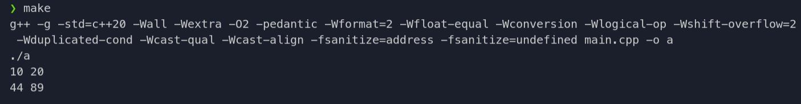

# Цели

Данная работа предназначена для приобретения навыков разработки контейнерных классов с итераторам. 

# Задачи

Согласно заданию требуется составить контейнерный класс (или шаблон контейнерного класса) и итератор для перебора содержимого объектов этого класса.

Последовательность квадратов, каждый из которых задаётся координатами центра и длиной стороны. Обращение к элементам последовательности должно осуществляться с помощью перегруженной операции «[ ]». Для последовательности должен быть реализован однонаправленный итератор по площадям квадратов. При изменении площади квадрата через итератор должна меняться длина его стороны.

# Решение

## Исходный код

**`SquareSeq.hpp`**

```{ .cpp .number-lines startFrom="1" .lineAnchors }
#ifndef SQUARE_SEQ
#define SQUARE_SEQ 1

#include <iterator>
#include <cmath>

struct Square {
    int x, y;
    size_t area;
    Square(int x, int y, int a) : x(x), y(y), area(a * a) {};
    Square() {x = y =  0; area = 0;};
    size_t length() {
        return (size_t)sqrt((double)area);
    }
};

class SquareSeq{
private:
    Square* arr;
    size_t n;
public:
    SquareSeq(size_t n): n(n) {
        arr = new Square[n];
    }
    ~SquareSeq(){
        delete [] arr;
    }
    Square& operator[] (size_t index){
        return arr[index];
    }
    struct Iterator{
        using iterator_category = std::forward_iterator_tag;
        using diffrence_type = std::ptrdiff_t;
        using value_type = size_t;
        using pointer = size_t*;
        using reference = size_t&;

        Iterator(Square* ptr, size_t n) : ptr(ptr), n(n) {};

        reference operator* () const {
            return (*ptr).area;
        }
        pointer operator-> () {
            return &(*ptr).area;
        }
        Iterator& operator++ () {
            ptr++;
            return *this;
        }
        Iterator operator++(int) {
            Iterator tmp = *this;
            ++(*this);
            return tmp;
        }
        friend bool operator==(const Iterator& lhs, const Iterator& rhs){
            return lhs.ptr == rhs.ptr;
        }
        friend bool operator!=(const Iterator& lhs, const Iterator& rhs){
            return !(lhs == rhs);
        }
    private:
        Square* ptr;
        size_t n;
    };
    Iterator begin() {
        return Iterator(&arr[0], n);
    }
    Iterator end() {
        return Iterator(&arr[n], n);
    }
};

#endif

```

**`main.cpp`**

```{.cpp .number-lines}
#include <iostream>
#include "SquareSeq.hpp"

int main()
{
    SquareSeq test(2);
    test[0] = Square(10, 10, 10);
    test[1] = Square(10, 10, 20);
    for (size_t i = 0; i < 2; i++){
        std::cout<< test[i].length() << ' ';
    }
    std::cout<<'\n';
    for (auto &square : test){
        square *= 20;
    }
    for (size_t i = 0; i < 2; i++){
        std::cout<< test[i].length() << ' ';
    }
    
    std::cout<<'\n';
    return 0;
}

```

## Пример вывода


