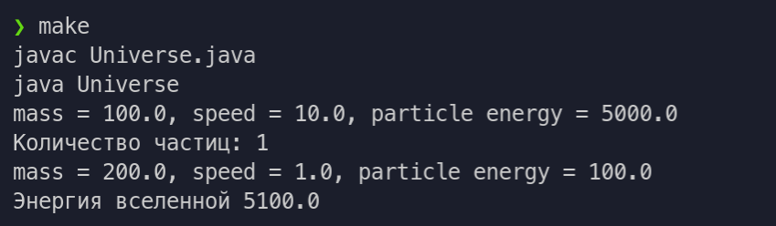

# Цели

Реализовать модель вселенной.

# Задачи

Вычислить суммарную кинетическую энергию частиц вселенной

# Решение

## Исходный код

`Particle.java`

```java
public class Particle {
    private static int n = 0;
    private double mass, speed, x, y, z;
    private static double energy = 0;

    public Particle(double inMass, double inSpeed){
        Particle.n += 1; 
        this.mass = inMass;
        this.speed = inSpeed;
        Particle.energy += mass * speed * speed / 2;
    }

    public Particle(double inMass, double x, double y, double z){
        Particle.
    }

    public static int n(){
        return Particle.n;
    }

    public String about(){
        return "mass = " + this.mass + ", speed = " + this.speed + ", particle energy = " + this.mass * this.speed * this.speed / 2;
    }

    public static double countEnergy(){
        return Particle.energy;
    }
}
```

`Universe.java`

```java
public class Universe {
    public static void main(String[] args) {
        Particle a = new Particle(100, 10);
        System.out.println(a.about());
        System.out.println("Количество частиц: " + Particle.n());

        Particle b = new Particle(200, 1);
        System.out.println(b.about());
        System.out.println("Энергия вселенной " + Particle.countEnergy());

        Particle c = new Particle(1000, 20);
        System.out.println(c.about());
        System.out.println("Количество частиц: " + Particle.n());
        System.out.println("Энергия вселенной " + Particle.countEnergy());
    }
}
```

## Пример вывода

