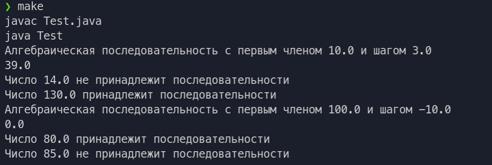

# Цели

Целью данной работы является изучение базовых возможностей языка Java.

# Задание

Класс арифметических прогрессий с операциями определения принадлежности числа прогрессии и вычисления суммы n первых членов прогрессии.

# Решение

### Исходный код

`Test.java`

```java
public class Test {
    public static void main(String[] args){
        Progression An1 = new Progression(10, 3);
        System.out.println(An1.toString());
        System.out.println(An1.countSum(3)); //10 + 13 + 16 = 39
        An1.ifBelongs(14);
        An1.ifBelongs(130);

        Progression An2 = new Progression(100, -10);
        System.out.println(An2.toString());
        System.out.println(An2.countSum(21));
        An2.ifBelongs(80);
        An2.ifBelongs(85);
    }
}

```

`Progression.java`

```java
public class Progression {
    private double a1;
    private double d;

    public Progression(double inA1, double inD){
        this.a1 = inA1;
        this.d = inD;
    }

    public void ifBelongs(double x){
        if ((x - this.a1) % this.d == 0){
            System.out.println("Число " + x + " принадлежит последовательности");
        } else {
            System.out.println("Число " + x + " не принадлежит последовательности");
        }
    }

    public double countSum(int n){
        return (2 * this.a1 + this.d * (n - 1)) * n / 2;
    }

    public String toString(){
        return "Алгебраическая последовательность с первым членом " + this.a1 + " и шагом " + this.d;
    }
}

```

### Пример вывода

