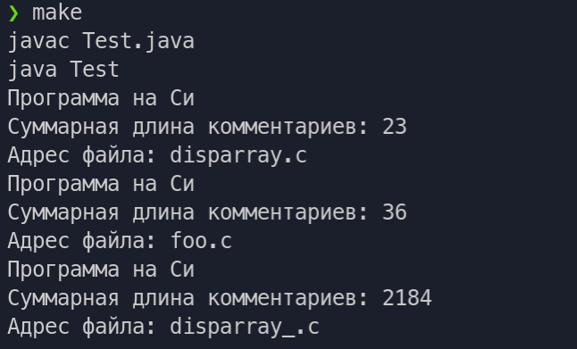

# Цели

Приобретение навыков реализации интерфейсов для обеспечения возможности
полиморфной обработки объектов класса.

# Задачи

Реализовать класс программ, написанных на языке C, с порядком на
основе суммарной длины комментариев в программе.

Во время выполнения лабораторной работы требуется разработать на языке Java один из
классов, перечисленных в таблице. В классе должен быть реализован интерфейс Comparable<T>
и переопределён метод toString. В методе main вспомогательного класса Test нужно
продемонстрировать работоспособность разработанного класса путём сортировки массива его
экземпляров.

# Решение

## Исходный код

`CProgram.java`

```java
import java.io.*;

public class CProgram implements Comparable<CProgram > {
    private int count = 0;
    private String SourceCode;
    private String fileName;

    public CProgram(String fileName){
        StringBuilder sb = new StringBuilder();
        File file = new File(fileName);
        int bigComStatus = 0;
        try {
            BufferedReader in = new BufferedReader(new FileReader( file.getAbsoluteFile()));
            try {
                String s;
                while ((s = in.readLine()) != null) {
                    sb.append(s);
                    sb.append("\n");
                    if (bigComStatus == 1){
                        int bigComPosEnd = s.indexOf("*/");
                        if (bigComPosEnd >= 0){
                            this.count += s.indexOf("*/");
                            bigComStatus = 0;
                        }else{
                            this.count += s.length();
                        }
                    }else{
                        int comPos = s.indexOf("//");
                        int bigComPos = s.indexOf("/*");
                        if (comPos == -1 && bigComPos >= 0){
                            bigComStatus = 1;
                            this.count += s.length() - bigComPos;
                        }else{
                            if (comPos >= 0 && bigComPos == -1){
                                this.count += s.length() - comPos;
                            }else{
                                if (comPos < bigComPos){
                                    this.count += s.length() - comPos;
                                }else if (comPos > bigComPos){
                                    this.count += s.length() - bigComPos;
                                    bigComStatus = 1;
                                }
                            }
                        }
                    }

                }
            } finally {
                in.close();
            }
        } catch(IOException e) {
            throw new RuntimeException(e);
        }
        this.SourceCode =  sb.toString();
        this.fileName = fileName;
    }

    public int compareTo(CProgram obj){
        return this.count - obj.count;
    }

    public String toString(){
        return "Программа на Си\n" + "Суммарная длина комментариев: " + this.count + "\nАдрес файла: " + this.fileName;
    }

    public String toStringFull(){
        return this.toString()+ "\nИсходный код: \n" + this.SourceCode;
    }

    public void Print(){
        System.out.println(SourceCode);
    }
}
```

`Test.java`

```java
import java.util.Arrays;

public class Test {
    public static void main(String[] args) {
        CProgram[] programs = new CProgram[]{
        new CProgram("disparray.c"),
        new CProgram("disparray_.c"),
        new CProgram("foo.c"),
        };
        Arrays.sort(programs);
        for (CProgram cProgram : programs) {
            System.out.println(cProgram);
        }
    }
}
```

Файл `foo.c` имеет следующее содержимое:
```c
//комментарий довольно большой длины
#include <stdio.h>
```

Файл `disparray.c` содержит в себе решение задачи из курса Алгоритмы и структуры данных(3 модуль) с добавленной 1 строкой комментарием. [Исходный код можно найти здесь](https://github.com/geogreck/ics9-c/tree/master/module3)

Файл `disparray_.c` тот же файл, только целиком закомментированный.

## Пример вывода




