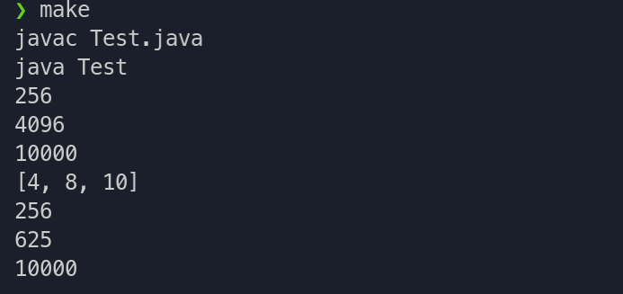

# Цели

Изучение обобщённых итераторов и экземплярных вложенных классов языка Java. 

# Задачи

Во время выполнения лабораторной работы требуется разработать на языке Java 

>Mножество целых чисел с итератором по размещениям с повторениями по m элементов (m задаётся в конструкторе). 

Класс должен реализовывать интерфейс Iterable. 
Объект разрабатывемого класса должен быть изменяемым, то есть в нём надо так или иначе предусмотреть возможность изменения внутреннего состояния. 

В методе main вспомогательного класса Test нужно продемонстрировать работоспособность разработанного класса. 

# Решение

## Исходный код

**`IntSet.java`**

```java
import java.util.Iterator;

public class IntSet implements Iterable<Integer> {
    private Integer[] container;
    private int m;

    public IntSet(int m){
        this.m = m;
    }

    public void fillContainer(int... ints) {
        container = new Integer[ints.length];
        for (int i = 0; i < ints.length; i++) {
            container[i] = ints[i];
        }
    }

    public void changeElem(int i, int x) {
        try {
            container[i] = x;
        } catch (Exception e) {
            System.out.println("Error: index out of bounds");
        }
    }

    public void setM(int m) {
        this.m = m;
    }

    public int getM() {
        return m;
    }

    @Override
    public String toString() {
        String ans = "[" + container[0];
        for (int i = 1; i < container.length; i++) {
                ans += ", " + container[i];
        }
        return ans + "]";
    }

    public Iterator<Integer> iterator() {
        return new IntSetIterator();
    }

    private class IntSetIterator implements Iterator<Integer>{
        private int pos;

        public IntSetIterator(){
            pos = 0;
        }

        @Override
        public boolean hasNext() {
            return pos < container.length;
        }

        @Override
        public Integer next() {
            return (int) Math.pow(container[pos++], m);
        }
    }

}

```

**`Test.java`**

```java
public class Test {
    public static void main(String[] args) {
        IntSet set = new IntSet(4);
        set.fillContainer(4, 8, 10);
        for (Integer integer : set) {
            System.out.println(integer);
        }
        System.out.println(set);
        set.changeElem(1, 5);
        for (Integer integer : set) {
            System.out.println(integer);
        }
    }
}

```

## Пример вывода

