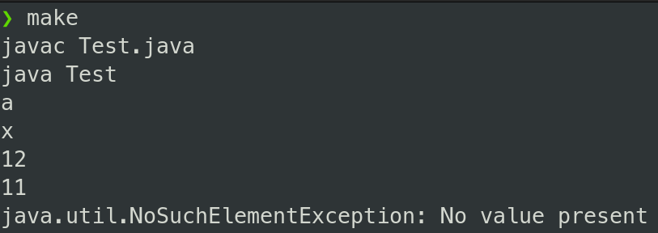

# Цели

Приобретение навыков использования монад Optional и Stream в программах на языке Java. 

# Задачи

Во время выполнения лабораторной работы требуется разработать на языке Java один из классов, перечисленных в таблице, которая приведена ниже. 

В каждом классе нужно реализовать по крайней мере два метода: первый метод должен возвращать Stream, а второй – Optional. Операции, выполняемые каждым методом, указаны в вариантах задания. 

В методе main вспомогательного класса Test нужно продемонстрировать работоспособность разработанного класса, осуществив группировку содержимого потока, возвращаемого первым методом, с помощью группирующего коллектора. 

В исходном коде (включая класс Test) запрещено использовать циклы и рекурсию.  


Множество неравенств вида x > a, где x – имя переменной, a a – целое число, с операциями: 

1. порождение на основе множества неравенств потока имён переменных, которые могут принимать только положительные значения; 
2. вычисление минимального значения указанной переменной, удовлетворяющего всем неравенствам, в которые она входит. 

Проверить работу первой операции нужно путём группировки имён переменных по первой букве.

# Решение

## Исходный код

**`EquasionsSet.java`**

```java
import java.util.ArrayList;
import java.util.Comparator;
import java.util.HashMap;
import java.util.Optional;
import java.util.stream.Stream;

public class EquasionsSet {
    private HashMap<String, ArrayList<Integer>> Set;
    int amount;

    public EquasionsSet() {
        amount = 0;
        Set = new HashMap<String, ArrayList<Integer>>();
    }

    public Optional<Integer> getVarMinValue(String varName) {
        Optional<Integer> result = Optional.empty();
        Optional<ArrayList<Integer>> temp = Optional.ofNullable(Set.get(varName));
        if (temp.isPresent()) {
            result = Optional.ofNullable(temp.get().stream().max(Comparator.comparing(Integer::valueOf)).get() + 1);
        }
        return result;
    }

    public void addEquasion(String expr) {
        Equasion eqs = new Equasion(expr);
        ArrayList<Integer> arr = Set.get(eqs.varName);
        if (arr == null) {
            arr = new ArrayList<Integer>();
        }
        arr.add(eqs.a);
        Set.put(eqs.getVarName(), arr);
    }

    public void addEquasion(String varName, int a) {
        Equasion eqs = new Equasion(varName, a);
        ArrayList<Integer> arr = Set.get(eqs.varName);
        if (arr == null) {
            arr = new ArrayList<Integer>();
        }
        arr.add(eqs.a);
        Set.put(eqs.getVarName(), arr);
    }

    public Stream<String> equasionStream(){
        ArrayList<String> result = new ArrayList<String>();
        Set.entrySet().stream().filter(x -> x.getValue().stream().filter(y -> y >= 0).count() > 0).forEach(x -> result.add(x.getKey()));
        return result.stream();
    }

    private class Equasion {
        private String varName;
        private int a;

        public Equasion(String expr){
            try {
                int i = expr.indexOf(">");
                varName = expr.substring(0, i);
                a = Integer.parseInt(expr.substring(i + 1, expr.length()));
            } catch (Exception e) {
                System.out.println("Error: Not an equasion");
            }
        }

        public Equasion(String varName, int a){
            this.varName = varName;
            this.a = a;
        }

        public String getVarName() {
            return varName;
        }

        @Override
        public String toString() {
            return varName + ">" + a;
        }
    }
}

```

**`NameComparator.java`**

```java
import java.util.Comparator;

public class NameComparator implements Comparator<String> {
    public int compare(String a, String b) {
        char a0, b0;
        a0 = a.charAt(0);
        b0 = b.charAt(0);
        if (a0 > b0) { return 1; }
        if (a0 == b0) { return 0; }
        return -1;
    }
}

```

**`Test.java`**

```java
import java.util.NoSuchElementException;

public class Test {
    public static void main(String[] args) {
        EquasionsSet test = new EquasionsSet();
        test.addEquasion("x>0");
        test.addEquasion("x>-10");
        test.addEquasion("a", 10);
        test.addEquasion("x", 11);
        test.equasionStream().sorted(new NameComparator()).forEach(System.out::println);

        System.out.println(test.getVarMinValue("x").get());
        System.out.println(test.getVarMinValue("a").get());
        try {
            System.out.println(test.getVarMinValue("c").get());  
        } catch (NoSuchElementException e) {
            System.out.println(e);
        }
    }
}

```

## Пример вывода

