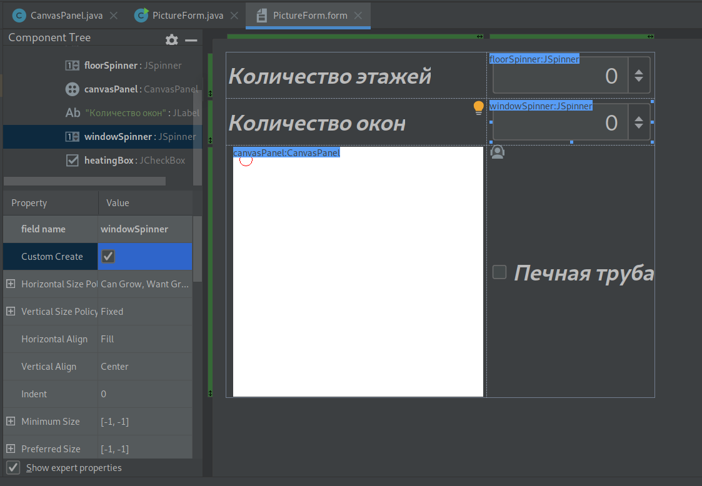
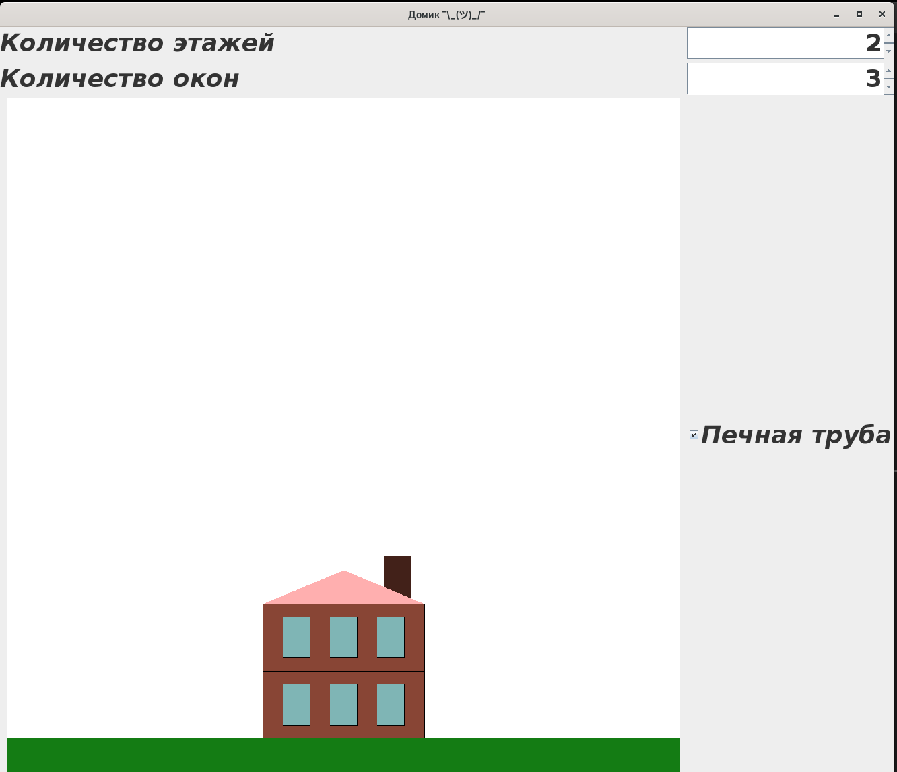
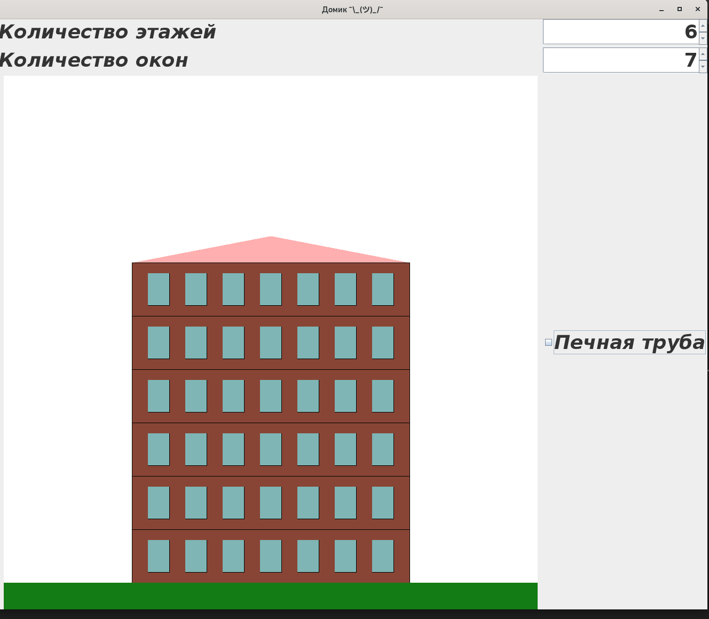

# Цели

&nbsp;&nbsp; Приобретение навыков разработки программ с графическим пользовательским интерфейсом на основе библиотеки swing.

# Задачи

&nbsp;&nbsp; «Домик» с двускатной крышей, у которого n
этажей, а на каждом этаже по m окон. Печное
отопление – по желанию пользователя.

# Решение

## Исходный код

**`PictureForm.java`**

```java
import javax.swing.*;
import javax.swing.event.ChangeEvent;
import javax.swing.event.ChangeListener;

public class PictureForm {
    private JPanel mainPanel;
    private JSpinner floorSpinner;
    private CanvasPanel canvasPanel;
    private JSpinner windowSpinner;
    private JCheckBox heatingBox;

    public PictureForm() {
        floorSpinner.setValue(2);
        windowSpinner.setValue(3);
        heatingBox.setSelected(true);


        floorSpinner.addChangeListener(new ChangeListener() {
            @Override
            public void stateChanged(ChangeEvent e) {
                int floors = (int) floorSpinner.getValue();
                canvasPanel.setFloors(floors);
            }
        });

        windowSpinner.addChangeListener(new ChangeListener() {
            @Override
            public void stateChanged(ChangeEvent e) {
                int windows = (int) windowSpinner.getValue();
                canvasPanel.setWindows(windows);
            }
        });
        heatingBox.addChangeListener(new ChangeListener() {
            @Override
            public void stateChanged(ChangeEvent e) {
                boolean heating = (boolean) heatingBox.isSelected();
                canvasPanel.setHeating(heating);
            }
        });
    }

    public static void main(String[] args) {
        JFrame frame = new JFrame("Домик ¯\\_(*)_/¯");
        frame.setContentPane(new PictureForm().mainPanel);
        frame.setDefaultCloseOperation(JFrame.EXIT_ON_CLOSE);
        frame.pack();
        frame.setVisible(true);
    }

    private void createUIComponents() {
        // TODO: place custom component creation code here
        floorSpinner = new JSpinner(new SpinnerNumberModel(2, -2, 10, 1));
        windowSpinner = new JSpinner(new SpinnerNumberModel(3, 0, 100, 1));
    }
}

```

**`CanvasPanel.java`**

```java
import javax.swing.*;
import java.awt.*;

public class CanvasPanel extends JPanel {
    private  int floors = 2;
    private  int windows = 3;
    private boolean heating = true;

    public void setFloors(int floors){
        this.floors = floors;
        repaint();
    }

    public void setWindows(int windows) {
        this.windows = windows;
        repaint();
    }

    public void setHeating(boolean heating) {
        this.heating = heating;
        repaint();
    }

    @Override
    protected void paintComponent(Graphics g){
        super.paintComponent(g);
        Color brown = new Color(136, 69, 53);
        Color blue = new Color(127, 181, 181);
        Color green = new Color(20, 124, 20);
        int width = 100 + (windows - 1) * 70;
        int x0 = (this.getWidth() - width) / 2;
        int y0 = 950 - 100 * floors;
        for (int i = 1; i <= floors; i++){
            g.setColor(brown);
            y0 = 950 - 100 * i;
            g.fillRect(x0,y0,width,100);
            g.setColor(Color.BLACK);
            g.drawRect(x0, y0, width,100);
            for (int j = 0; j < windows; j++) {
                g.setColor(Color.BLACK);
                g.drawRect(x0 + 30 + j * 70, y0 + 20, 40, 60);
                g.setColor(blue);
                g.fillRect(x0 + 30 + j * 70, y0 + 20, 40, 60);
            }
        }

        g.setColor(green);
        g.fillRect(0, 950,1000, 50);

        if (heating) {
            g.setColor(brown.darker().darker());
            int heatingWidth = windows > 2 ? 40 : 7 + windows * 10;
            g.fillRect(x0 + 3 * width / 4, y0 - 70, heatingWidth, 70);
        }

        g.setColor(Color.PINK);
        int[] arrX = new int[]{
                x0, getWidth() / 2, getWidth() - x0
        };
        int[] arrY = new int[]{
                y0, y0 - 50, y0
        };
        g.fillPolygon(arrX, arrY, 3);
    }
}

```

## Конструктор формы



## Примеры вывода



