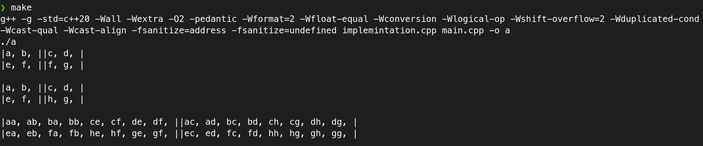

# Цели

Целью данной работы является изучение базовых объектно-ориентированных
возможностей языка C++.

# Задачи

Выполнение лабораторной работы заключается в составлении на языке C++
программы, состоящей из трёх файлов:

- заголовочный файл **`declaration.h`** с объявлением одного из классов,
приведённых в таблицах 1 – 16;
- файл **`implementation.cpp`** с определениями методов класса;
- файл **`main.cpp`**, содержащий функцию main и, возможно, вспомогательные
функции для проверки работоспособности класса.

Реализация класса не должна опираться на стандартные контейнерные классы
C++, то есть внутреннее состояние объектов класса должно быть реализовано через обычные
массивы. Соответственно, в классе обязательно требуется реализовать:

- конструктор копий;
- деструктор (должен быть объявлен виртуальным);
- операцию присваивания.

Проверку работоспособности класса требуется организовать в функции `main`,
размещённой в файле **`main.cpp.`**
Проверка должна включать в себя:

- создание объекта класса в автоматической памяти;
- передачу объекта класса по значению в функцию;
- присваивание объекта класса переменной.

## Формулировка задачи

Квадратная матрица, элементами которой
являются упорядоченные множества строк, с
операциями:

1. получение ссылки на элемент **(i, j)**;
2. умножение матрицы на саму себя.

При выполнении умножения матрицы считать,
что для множеств строк операции сложения и
умножения определены следующим образом:

### Сложение множеств A и B

>Объединение этих множеств;

### Умножение множеств A и B

>Результатом умножения является множество, составленное из конкатенаций всех возможных пар строк таких, что первая строка принадлежит A, а вторая – принадлежит B.

Для представления строк нужно использовать
стандартный класс **`string`**.

\vspace{5cm}

# Решение

## Исходный код

**`Declaration.h`**

```cpp
#ifndef STRING_MATRIX
#define STRING_MATRIX

#include <string>

class StringMatrix
{
private:
    std::string*** matrix;
    size_t m, amount;
    void stringSetAdd(std::string** a, std::string* b, size_t cur_amount, size_t amount);
    std::string* stringSetMult(std::string* a, std::string* b, size_t amount);
public:
    StringMatrix(size_t m, size_t amount);
    StringMatrix(const StringMatrix& obj);
    size_t getM();
    size_t getAmount();
    std::string** operator[](size_t i);
    StringMatrix& operator=(const StringMatrix& obj);
    StringMatrix* multiply();
    virtual ~StringMatrix();
};

#endif

```

**`implemintation.cpp`**

```cpp
#include "declaration.h"
#include <iostream>
#include <algorithm>

StringMatrix::StringMatrix(size_t m, size_t amount): m(m), amount(amount){
    matrix = new std::string**[m];
    for (size_t i = 0; i < m; i++)
    {
        matrix[i] = new std::string*[m];
    }    
}

StringMatrix::StringMatrix(const StringMatrix &obj): m(obj.m), amount(obj.amount){
    matrix = new std::string**[m];
    for (size_t i = 0; i < m; i++)
    {
        matrix[i] = new std::string*[m];
    }
    for (size_t i = 0; i < m; i++)
    {
        for (size_t j = 0; j < m; j++)
        {
            matrix[i][j] = new std::string[amount];
        }
    }
     
    for (size_t i = 0; i < m; i++)
    {
        for (size_t j = 0; j < m; j++)
        {
            std::copy(obj.matrix[i][j], obj.matrix[i][j] + amount, this->matrix[i][j]);
        }
        
    }
}

size_t StringMatrix::getM(){
    return m;
}

size_t StringMatrix::getAmount(){
    return amount;
}

std::string** StringMatrix::operator[](size_t i){
    return matrix[i];
}

StringMatrix& StringMatrix::operator=(const StringMatrix& obj){
    if (this!= &obj){
        this->m = obj.m;
        matrix = new std::string**[m];
        for (size_t i = 0; i < m; i++)
        {
            matrix[i] = new std::string*[m];
        }
        for (size_t i = 0; i < m; i++)
        {
            for (size_t j = 0; j < m; j++)
            {
                matrix[i][j] = new std::string[amount];
            }
        }
        
        delete [] this->matrix;
        for (size_t i = 0; i < m; i++)
        {
            for (size_t j = 0; j < m; j++)
            {
                std::copy(obj.matrix[i][j], obj.matrix[i][j] + amount, this->matrix[i][j]);
            }
            
        }
    }

    return *this;
}

void StringMatrix::stringSetAdd(std::string** a, std::string* b, size_t cur_amount, size_t amount){
    for (size_t i = 0; i < amount - cur_amount; i++)
    {
        (*a)[i + cur_amount] = b[i];
    }
}

std::string* StringMatrix::stringSetMult(std::string* a, std::string* b, size_t amount){
    std::string* buf = new std::string[amount * amount];
    size_t k = 0;
    for (size_t i = 0; i < amount; i++)
    {
        for (size_t j = 0; j < amount; j++)
        {
            buf[k++] = a[i] + b[j];
        }
    }
    return buf;
}

StringMatrix* StringMatrix::multiply(){
    StringMatrix* temp = new StringMatrix(m, amount * amount * amount);
    for (size_t i = 0; i < m; i++)
        {
            for (size_t j = 0; j < m; j++)
            {
                temp->matrix[i][j] = new std::string[amount * amount * amount];
            }
        }
    for (size_t i = 0; i < m; i++){
        for (size_t j = 0; j < m; j++){
            size_t cur_amount = 0;
            size_t h = amount * amount;
            for (size_t k = 0; k < m; k++){
                std::string* foo = stringSetMult(matrix[i][k], matrix[k][j], amount);
                stringSetAdd(&(temp->matrix[i][j]), foo, cur_amount, h);
                cur_amount+= amount * amount;
                h *= amount;
                delete[] foo;
            }
        }
        
    }
    return temp;
    
}

StringMatrix::~StringMatrix(){
    for (size_t i = 0; i < m; i++)
    {
        for (size_t j = 0; j < m; j++)
        {
            delete[] matrix[i][j];
        }
        delete[] matrix[i];
    }
    delete[] matrix;
}

```

**`main.cpp`**

```cpp
#include "declaration.h"
#include <iostream>

void display(StringMatrix stM){
    for (size_t i = 0; i < stM.getM(); i++)
    {
        for (size_t j = 0; j < stM.getM(); j++)
        {
            std::cout<<"|";
            for (size_t k = 0; k < stM.getAmount(); k++)
            {
                std::cout<<stM[i][j][k]<<", ";
            }
            std::cout<<"|";
        }
        std::cout<<"\n";
    }
    std::cout<<"\n";
}

void foo(StringMatrix stM){
    stM[1][1][0] = "f";
    display(stM);
}

int main(){
    StringMatrix test(2, 2);
    std::string* foo1 = new std::string[2]{"a", "b"}; // a, b | c, d
    std::string* foo2 = new std::string[2]{"c", "d"}; // _____|_____
    std::string* foo3 = new std::string[2]{"e", "f"}; //      |  
    std::string* foo4 = new std::string[2]{"h", "g"}; // e, f | h, g
    test[0][0] = foo1;
    test[1][0] = foo3;
    test[0][1] = foo2;
    test[1][1] = foo4;
    foo(test); // Проверка работы конструктора копий
    display(test); //Копия изменилась, сам объект не изменился
    StringMatrix t = test; //Присваиваем объект переменной
    StringMatrix* foo = test.multiply(); //Умножение матрицы на саму себя возвращает нам новую матрицу
    display(*foo);
    delete foo;
    return 0;

}

```

**`Параметры сборки`**

```s
g++ -g -std=c++20 -Wall -Wextra -O2 -pedantic -Wformat=2 -Wfloat-equal -Wconversion -Wlogical-op -Wshift-overflow=2 -Wduplicated-cond -Wcast-qual -Wcast-align -fsanitize=address -fsanitize=undefined implemintation.cpp main.cpp -o a
```
 
Санитазейры присутствуют в флагах сборки, поэтому утечки памяти исключены.

## Пример вывода

