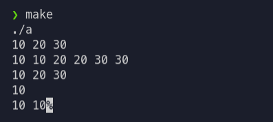

# Цели

Данная работа предназначена для изучения возможностей языка C++, обеспечивающих применение знаков операций к объектам пользовательских типов. 

# Задачи

**`Seq<T>`** – последовательность отсортированных по возрастанию значений типа T. (Подразумевается, что для типа T определены
операции «<» и «==».) Операции:

1. «+» – слияние двух последовательностей в одну;
2. «∗» – умножение на число k (каждый элемент исходной последовательности повторяется в результирующей последовательности k раз);
3. «!» – удаление из последовательности дублирующихся значений (в результате формируется новая последовательность);
4. «[ ]» – получение i-го элемента последовательности.

# Решение

## Исходный код

**`Seq.hpp`**

```cpp
#ifndef SEQ_H
#define SEQ_H 1

#include <vector>
#include <iostream>
#include <algorithm>
#include <set>

template <typename T>
class Seq
{
private:
    std::vector<T> container;
public:
    Seq();
    Seq<T>& operator+= (const Seq<T>& obj){
        container.reserve(obj.container.size());
        container.insert(container.end(), obj.container.begin(), obj.container.end());
        std::sort(container.begin(), container.end());
        return *this;
    }
    Seq<T> operator+ (const Seq<T>& obj){
        return Seq<T>(*this) += obj;
    }
    Seq<T>& operator*=(const size_t k){
        std::vector<T> new_container;
        for (auto x : container)
        {
            for (size_t i = 0; i < k; i++)
            {
                new_container.push_back(x);
            }
        }
        container = new_container;
        return *this;
    }
    Seq<T> operator* (const size_t k){
        return Seq<T>(*this) *= k;
    }
    Seq<T> operator! (){
        std::set<T> s( container.begin(), container.end() );
        container.assign(s.begin(), s.end());
        return *this;
    }
    T operator[] (size_t index){
        return container[index];
    }
    void insert(T data){
        container.push_back(data);
        std::sort(container.begin(), container.end());
    }
    void print(){
        for (auto x : container)
        {
            std::cout<<x<<" ";
        }
        std::cout<<'\n';
    }
    

};

template <typename T>
Seq<T>::Seq()
{
    container = {};
}

#endif

```

**`main.cpp`**

```cpp
#include "Seq.hpp"
#include <cmath>

struct radiusVector
{
    float x, y;
    bool operator<(radiusVector& obj){
        return (sqrt(x * 2 + y * 2) - sqrt(obj.x * 2 + obj.y * 2)) < 0;
    }
    bool operator==(radiusVector& obj){
        return (x == obj.x) && (y = obj.y);
    }
};


int main()
{
    Seq<int> test1;
    Seq<int> test2;
    test1.insert(30);
    test1.insert(10);
    test2.insert(20);

    Seq<int> test3 = test1 + test2; // Слияние
    test3.print();
    test3 = test3 * 2; //Умножение на число
    test3.print();
    !test3; // Уничтожение дупликатов
    test3.print();
    std::cout<<test3[0] << '\n'; // Индексация элементов

    Seq<radiusVector> testr1;
    Seq<radiusVector> testr2;
    testr1.insert({10, 10});
    testr2.insert({5, 10});
    Seq<radiusVector> testr3 = testr1 + testr2;
    radiusVector x = testr3[1];
    std::cout<<x.x << ' '<<x.y;
    return 0;
}

```

## Пример вывода

